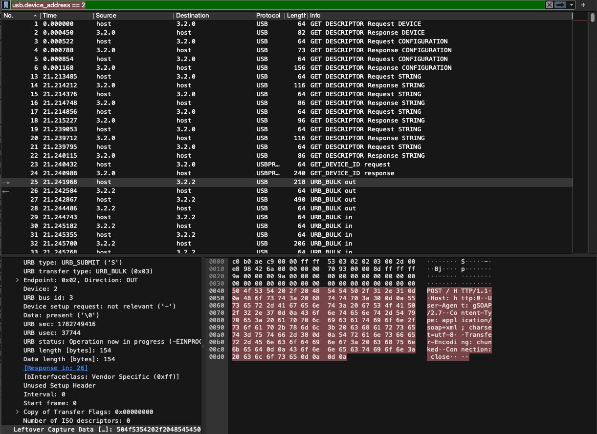

Created an ubuntu vm in UTM via QEMU

```
$ sudo apt update
$ sudo apt install hplip hplip-gui sane-utils

$ hp-plugin -i

$ hp-setup -i

$ scanimage -L
device 'hpaio:/usb/HP_LaserJet_Pro_MFP_M125a?serial=CNB6J5CK5J' is a Hewlett-Packard HP_LaserJet_Pro_MFP_M125a all-in-one

$ scanimage --format=jpeg --resolution 300 --mode Color > test_scan.jpg
```

And it scans in VM!

```
$ sudo apt install wireshark -y

$ sudo modprobe usbmon
$ sudo wireshark
```
(because I couldn't get userspace wireshark to read any interface despite trying user groups etc.)

```
$ lsusb
...
Bus 003 Device 002: ID 03f0:222a HP, Inc LaserJet Pro MFP M125nw
...
```

selected usbmon3 in wireshark and filtered by "usb.device_address == 2"

The beginning looks like: 


I saved the capture as pcapng.


(THE COMMAND TO ONLY EXPORT THE HTTP TRAFFIC FROM INNUMERABLE USB CHUNKS)
```
tshark -r scan_low.pcapng -Y "usb.device_address == 2 && usb.capdata" -T fields -e usb.capdata > payloads_lowq_hex.txt
```


(THE COMMAND TO CONVERT ASCII REPRESENTATION OF HEX INTO ACTUAL BINARY SO IT CAN BE READ AS ASCII)
```
$ perl -ne 's/([0-9a-fA-F]{2})/print pack("H2", $1)/eg' payloads_lowq_hex.txt > ascii_lowq.txt
```
(this is because "xxd -r" errors with "File too big")


Now we had ascii_lowq.txt, which is very big because it contains the jpeg data as well.

I removed the "seemingly garbage" image data, so the XML communication is much more readable, inside ascii_lowq_readable.txt


