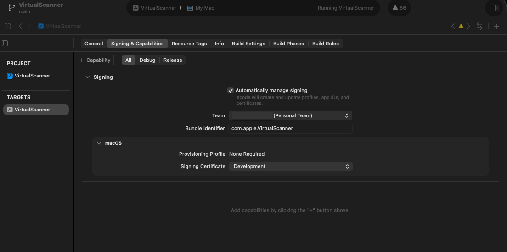
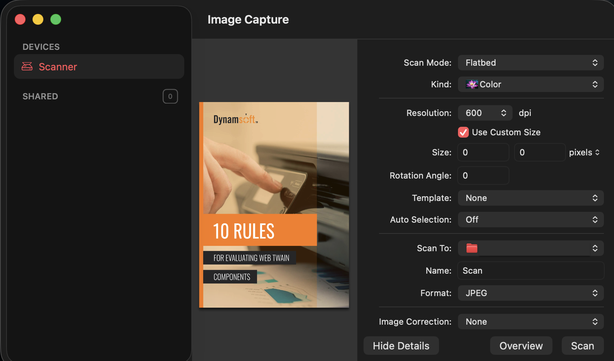

I will not go down AirScan path, before trying to write a Sane backend instead.


You can get scan-backends for macos via:

`% brew install sane-backends`

And there is already some hope:

```
% sane-find-scanner

  # sane-find-scanner will now attempt to detect your scanner.

found possible USB scanner (vendor=0x03f0 [Hewlett-Packard], product=0x222a [HP LaserJet Pro MFP M125a]) at libusb:001:001

  # Your USB scanner was (probably) detected. It may or may not be supported by
  # SANE. Try scanimage -L and read the backend's manpage.
```

Unfortunately, -but not surprisingly-

```
% scanimage -L

No scanners were identified. If you were expecting something different,
check that the scanner is plugged in, turned on and detected by the
sane-find-scanner tool (if appropriate). Please read the documentation
which came with this software (README, FAQ, manpages).
```

Right.

This is the original problem!

My scanner is not supported out of the box. 

> http://sane-project.org/lists/sane-backends-external.html \
> The following table summarizes the backends/drivers that have not yet been included in the SANE distribution, and the hardware or software they support.
>
> Backend: hpaio ()
> 
> Link(s): http://hpinkjet.sourceforge.net/ \
> Comment: This backend isn't included in SANE because it is included in the HPLIP software.
> 
> HP LaserJet Pro MFP m125a (is in the list)

---

A detour:

Upon seeing this, I remembered a repo 

https://github.com/nricaurte/hp-scan-macos

> A working SANE scanner backend for HP USB-only inkjet/AIO printers on macOS, including Apple Silicon. Builds HPLIP's hpaio backend from source with the patches needed to compile and run on Darwin.

"Okay!" I said. I can just install this hpaio backend and be done!

Except, look what they say:

> Image Capture / Preview / Notes / iPhone-iPad (via airscan-bridge): The build also installs a small Go service (airscan-bridge) that advertises the scanner over Bonjour as an AirScan/eSCL network device on the loopback interface. Apple's native scan stack (Image Capture.app, Preview's Import from Scanner, Notes' document scan, iOS Files / Notes scan over local network) all use AirScan, so the printer shows up under Shared in Image Capture as Smart Tank 500 series (USB-bridge) without any ICA driver.

> Why all these layers? macOS's native scan apps use Apple's ICA framework, which requires a vendor driver in /Library/Image Capture/Devices/. HPLIP/hpaio is a SANE backend — a parallel, Unix-style stack — so it doesn't show up in those apps directly. AirScan/eSCL is the third stack Apple uses for network scanners; we expose hpaio as an eSCL endpoint on localhost and Bonjour does the rest. End result: scanning works in every Apple scan app except HP Easy Scan, which is HP's own closed app and only trusts HP's own discovery channel.

WHAT!?

So... even if we got SANE working, it still won't be recognized by Image Capture?

But that defeats the whole purpose!

Now, we should take their word with some grains of salt because... it is heavily written by Claude. And you know how AI be. They say something is impossible, until you show the trick, then they accept the solution, but until you show the fix, it is very certain that it was impossible. So.. grain of salt.
But an important grain of salt nevertheless.

-

Apparently, there is no easy SANE-ICA adapter available.

However, what comes next is a new hope...

(end of detour)

---

VERY INTERESTING FINDINGS: "VirtualScanner"

https://dev.to/yushulx/using-apples-virtual-scanner-to-test-document-scanning-apps-and-sdks-on-macos-1pef

https://github.com/yushulx/virtual-scanner/tree/main/macos

which led to me learning about Apple's secret docs:

https://developer.apple.com/library/archive/navigation/
https://developer.apple.com/library/archive/samplecode/VirtualScanner/Introduction/Intro.html
https://developer.apple.com/library/archive/sitemap.php

and another repo:
https://github.com/fruitsamples/VirtualScanner


I cloned https://github.com/yushulx/virtual-scanner/ into ~/code/tmp/virtual-scanner

Opened the virtual-scanner/macos folder with XCode.

Build failed because it asked for a developer team.


I logged in with my apple account, and it built.



And it works in Image Capture!

My only hesitation is, whether this will be a problem on another machine.


Gemini Pro says:

> The Hacker Route (Free, Manual Installation) 
> 
> If you are just installing this on your own secondary Macs or a friend's machine, you do not need to pay Apple. 
> You just need to run two terminal commands on the target machine to strip Apple's security flags and re-sign it locally.
> 1. **Transfer the App:** Copy your built `.app` bundle to the target Mac and place it in `/Library/Image Capture/Devices/`.
> 2. **Remove the Quarantine Flag:** When you download or transfer a file, macOS tags it. You must clear this tag so the OS doesn't block execution. \
> `sudo xattr -cr "/Library/Image Capture/Devices/YourScanner.app"`
> 3. **Ad-Hoc Sign It:** Tell the target Mac to apply its own local, ad-hoc cryptographic signature to the bundle, essentially saying, "I trust this file." \
> `sudo codesign --force --deep --sign - "/Library/Image Capture/Devices/YourScanner.app"` 
> 
> Once you do that, the plugin will launch natively on the new machine exactly as it did on yours.

Let's hope he is right.

---

Antigravity suggests a hybrid solution:

Basically: Create VirtualScanner as thin as possible, and let it call the python scan.py

Good idea. We won't need to implement everything USB in Objective-C.

I may provide an extra:

Option A: \
  Write a go program to mimic python script. This way we won't need to install python venv. And a go project should not be that difficult.

Option B: \
  https://github.com/nricaurte/hp-scan-macos Use this as the backend. \
  If this compiles hpaio for arm64 macos as they claim, we could rely entirely on `scanimage` command. \
  This would require a `brew install sane-backends` but it would entirely remove our USB communicator code. \
  However keep in mind that "hp-scan-macos" repo creates an airscan scanner. We don't want that. So do not blindly build that entire repo.

Addendum for Option A: \
  How about this? https://github.com/OpenPrinting/go-mfp


With Antigravity, we've decided to go with Option A.


---


The Mad Lad (Antigravity) wrote both the go program (replacing our old python script) and the VirtualScanner.

This is the command to check errors:

`/usr/bin/log show --predicate 'process == "VirtualScanner" or eventMessage contains "VirtualScanner" or eventMessage contains "scan-go"' --last 5m`
